# dedecms v5.7 sp2 代码审计

## 任意文件上传

### 原理分析

漏洞点在于include/helpers/upload.helper.php

```php
$fileurl = $filedir.'/'.$filename.'.'.$file_sname;
$rs = move_uploaded_file($file_tmp, $cfg_basedir.$fileurl);
if(!$rs) return -2;
if($ftype=='image' && $watermark)
{
    WaterImg($cfg_basedir.$fileurl, 'up');
}
```

跟进`image`发现，这里针对文件上传都是检查`mime`

```php
switch($this->attachinfo['mime'])
{
    case 'image/jpeg':
        $this->imagecreatefromfunc = function_exists('imagecreatefromjpeg') ? 'imagecreatefromjpeg' : '';
        $this->imagefunc = function_exists('imagejpeg') ? 'imagejpeg' : '';
        break;
    case 'image/gif':
        $this->imagecreatefromfunc = function_exists('imagecreatefromgif') ? 'imagecreatefromgif' : '';
        $this->imagefunc = function_exists('imagegif') ? 'imagegif' : '';
        break;
    case 'image/png':
        $this->imagecreatefromfunc = function_exists('imagecreatefrompng') ? 'imagecreatefrompng' : '';
        $this->imagefunc = function_exists('imagepng') ? 'imagepng' : '';
        break;
}//为空则匹配类型的函数不存在
```

这样就很好绕过了。这里看看那里功能调用这个上传。我们看到这里要想进入文件上传功能，这里有个if判断`if ( ! function_exists('AdminUpload'))`。如果有AdminUpload这个函数，就进入这个功能，所以要找到哪里调用这个功能。

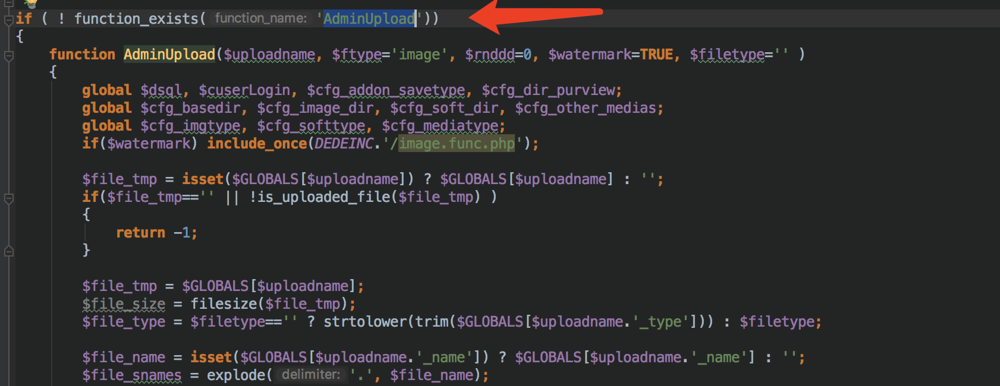

全局搜索这个函数在dede/archives_do.php 111行发现。

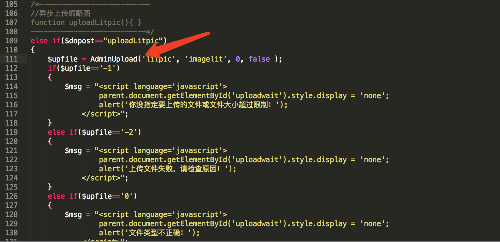

要想进入这个功能，首先要让`$dopost=="uploadLitpic"`。而且这里也用到前端校验文件类型，并且最后还返回路径

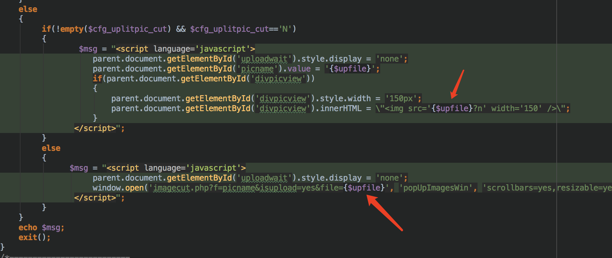

所以根据页面以及，php的路由找到了功能点。

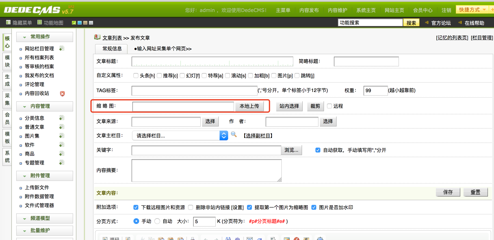

### poc构造

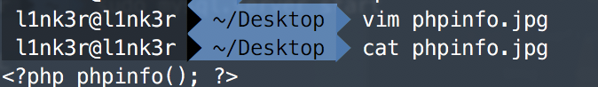

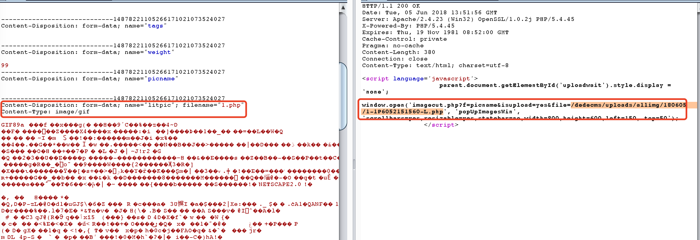

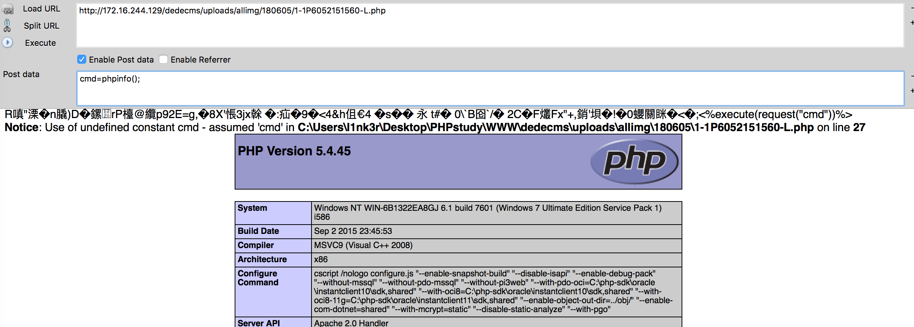


## 任意文件上传2

### 原理分析

漏洞点：dede/file_manage_control.php 112-137:

```php
else if($fmdo=="upload")
{
    $j=0;
    for($i=1; $i<=50; $i++)
    {
        $upfile = "upfile".$i;
        $upfile_name = "upfile".$i."_name";
        if(!isset(${$upfile}) || !isset(${$upfile_name}))
        {
            continue;
        }
        $upfile = ${$upfile};
        $upfile_name = ${$upfile_name};
        if(is_uploaded_file($upfile))
        {
            if(!file_exists($cfg_basedir.$activepath."/".$upfile_name))
            {
                move_uploaded_file($upfile, $cfg_basedir.$activepath."/".$upfile_name);
            }
            @unlink($upfile);
            $j++;
        }
    }
    ShowMsg("成功上传 $j 个文件到: $activepath","file_manage_main.php?activepath=$activepath");
    exit();
}
```

这里也是丝毫没有针对上传的任何内容做过滤嘛

### poc构造


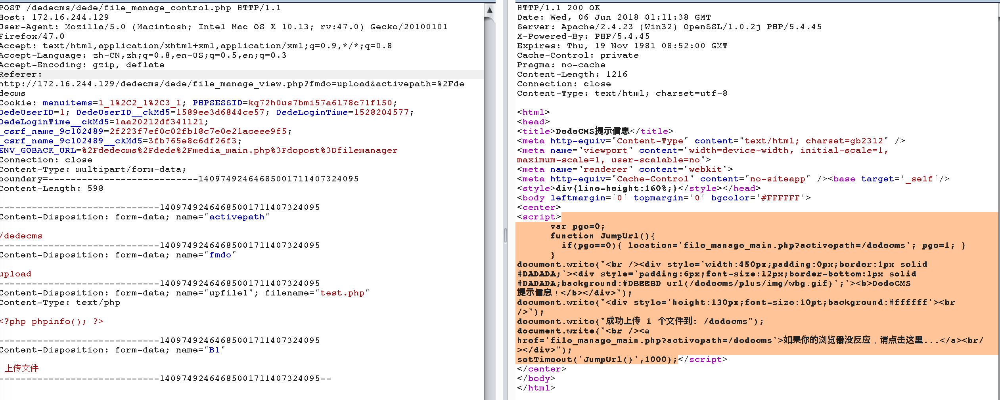

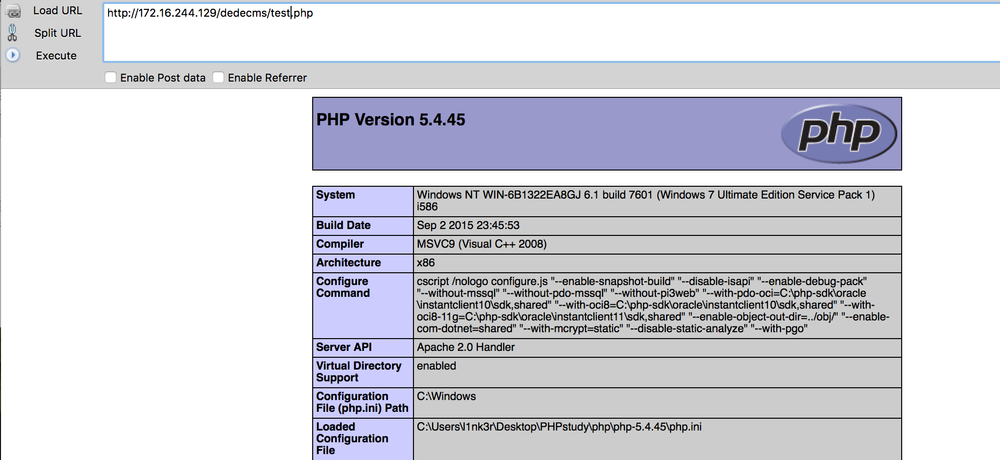

## 任意写入文件

### 原理分析

漏洞点：dede/file_manage_control.php 69-87:

```php
else if($fmdo=="edit")
{
    csrf_check();
    $filename = str_replace("..", "", $filename);
    $file = "$cfg_basedir$activepath/$filename";
    $str = stripslashes($str);
    $fp = fopen($file, "w");
    fputs($fp, $str);
    fclose($fp);
    if(empty($backurl))
    {
        ShowMsg("成功保存一个文件！","file_manage_main.php?activepath=$activepath");
    }
    else
    {
        ShowMsg("成功保存文件！",$backurl);
    }
    exit();
}
```

这里没有针对内容做丝毫的过滤处理，所以可以直接写入php脚本。

### poc构造


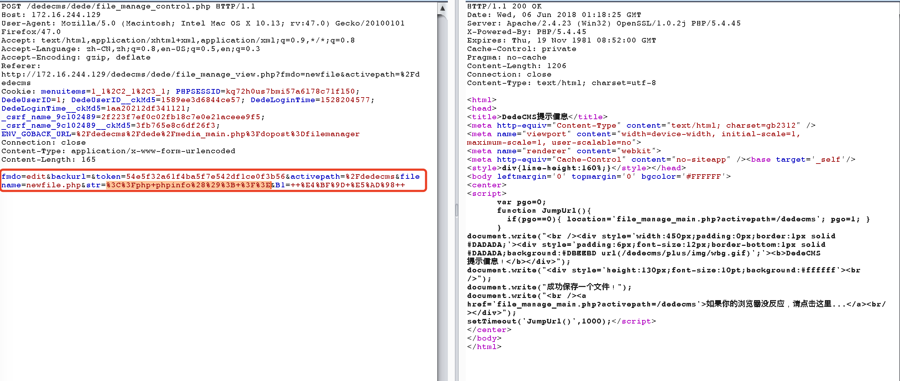

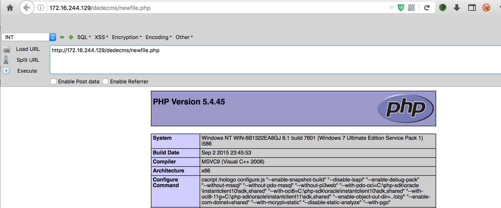

## 一些思考

最近看到的很多cms其实有文件管理功能，可以列文件，增加文件，修改文件，删除文件。但是这种功能对于cms来说真的有用吗，你允许上传，允许创建文件，却不对上传内容，文件内容进行校验。虽然很多地方的安全性蛮高的了，但是木桶效应，毁所有，至于这两个算不算漏洞，我觉得算，你们觉的呢。

