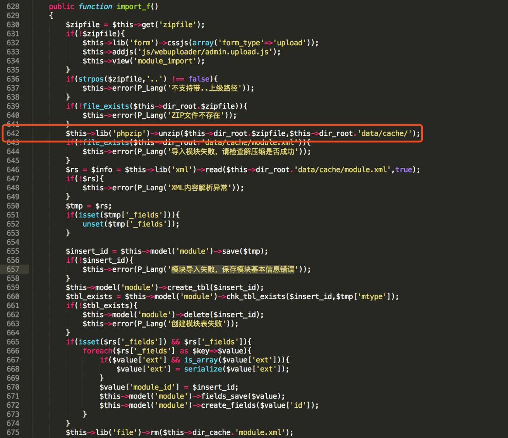
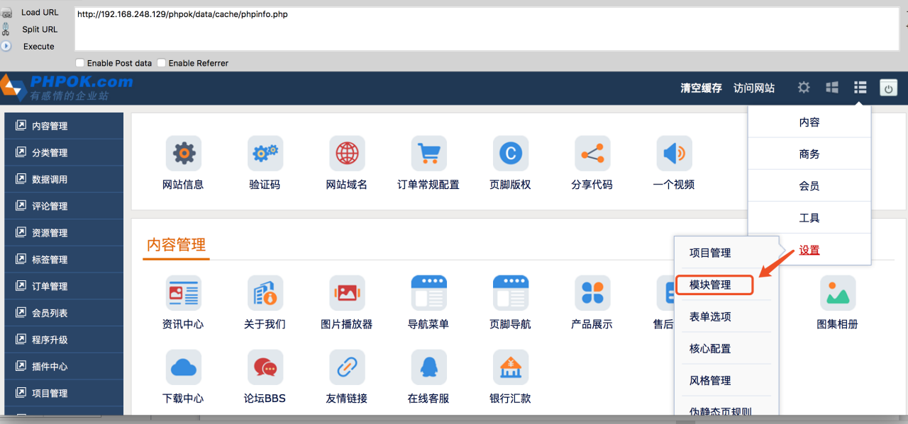
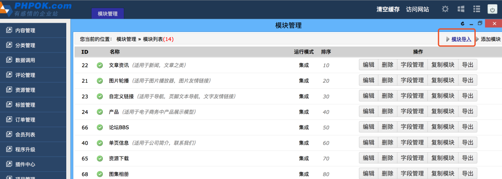
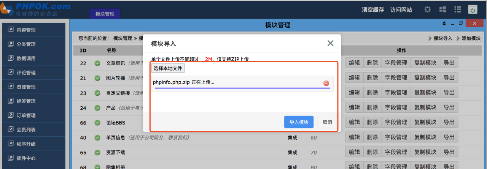
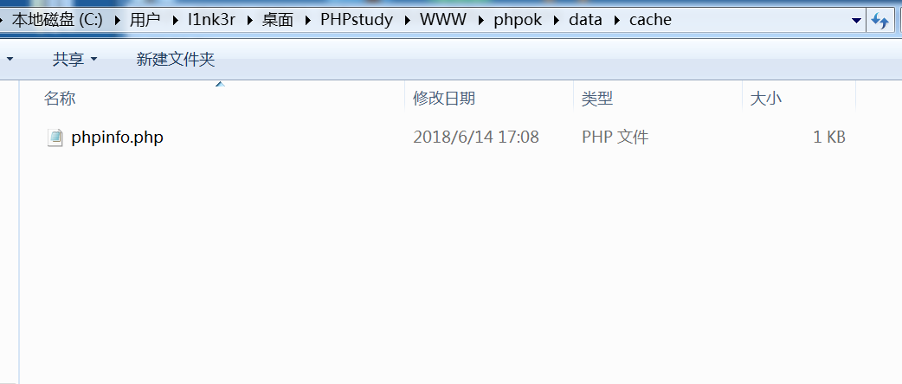
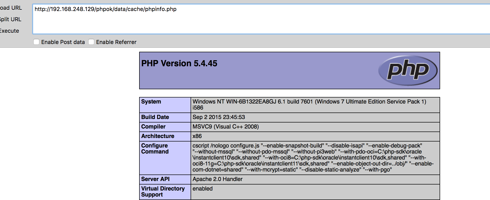
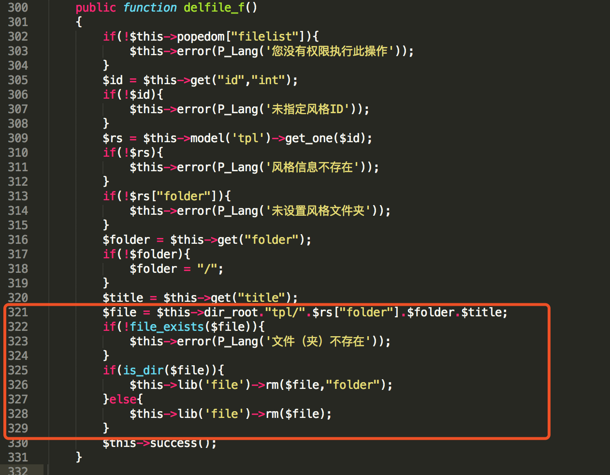
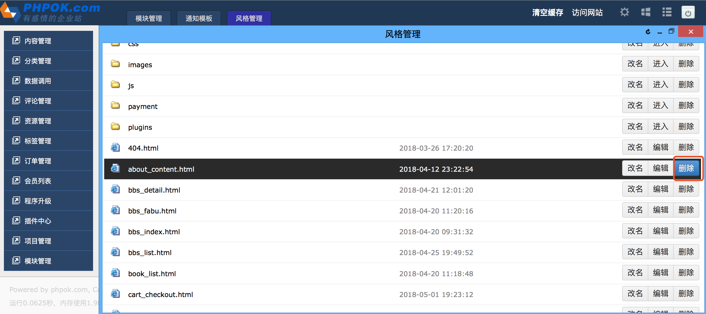
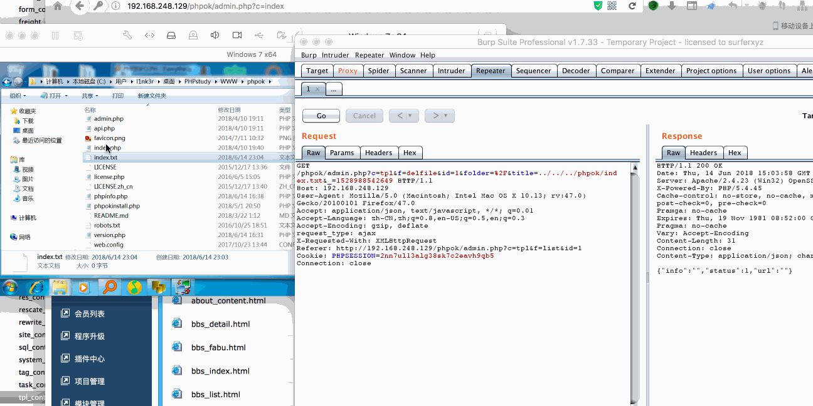

# Phpok 4.9.032

## 任意文件上传（upload vulnerability）

漏洞代码在framework/admin/modulec_control.php 642行。

这里直接将解压的文件存入/data/cache中，将phpinfo.php压缩到phpinfo.php.zip,点击设置，模块管理。

点击模块导入

上传

成功写入

## 任意文件删除 （Any file deletion vulnerability）

漏洞位置在于framework/admin/tpl_control.php

点击设置-风格管理

点击文件管理

点击文件删除

抓包修改`../../../phpok/index.txt`。 